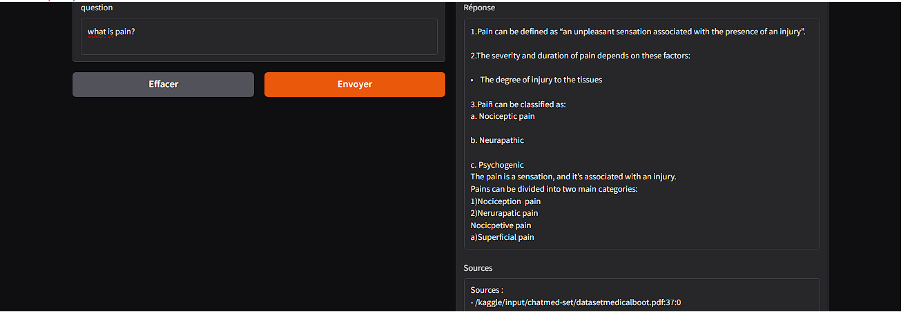

# llm-rag-QA
Developed a conversational agent using a pre-trained Large Language Model (LLM) with Retrieval-Augmented Generation (RAG) to answer  questions from PDF documents. Integrated LangChain, ChromaDB, Sentence Transformers, and Mistral 7B for semantic search and context-aware response generation.
# Chatbot

A Retrieval-Augmented Generation (RAG) chatbot that answers questions based on PDF documents using **Mistral**, **ChromaDB**, and a **Gradio** interface.

You can use this chatbot with any PDF documents by placing them in the `data/` directory and adjusting the path in the configuration.

---

## 🚀 Features

- Processes PDF documents to create a searchable knowledge base.
- Uses **Mistral** (via Hugging Face) for generating clear and concise answers.
- Provides a user-friendly **Gradio** web interface to ask questions and view responses with sources.
- Modular code structure for easy maintenance and extension.

---

## ⚙️ Setup

### ✅ Prerequisites

- Python 3.8+
- A GPU is recommended for faster model inference.
- Git installed for cloning the repository.

### 🔧 Installation

#### Clone the Repository:
```bash
git clone https://github.com/ImenBenAmar/llm-rag-QA.git
```
# install Dependencies:
```bash
pip install -r requirements.txt

```
# Prepare Your PDF Documents:

- Place your PDF files in the data/ directory (create it if it doesn't exist).

- The default data path is data/ (configured in src/config.py).
- If your PDFs are elsewhere, update DATA_PATH in src/config.py to point to your directory.
# (Optional) Adjust Model Path:
- The default model is mistralai/Mixtral-8x7B-Instruct-v0.1 (Hugging Face).

- Ensure you have internet access to download it or update MODEL_NAME in src/config.py if using a local model.

# 💬 Running the Chatbot

```bash
python run.py

```
# Access the Interface:

- A Gradio interface will launch in your browser (typically at http://localhost:7860).

- Enter a question related to your PDF documents.

- The chatbot will provide a concise answer and list the sources (document IDs) from the PDFs.

# 📂 Using with Any PDF
**This chatbot is flexible and can work with any PDF documents**


| Example 1                      | Example 2                           | Example 3                           |
|------------------------------|--------------------------------------|--------------------------------------|
|     |    |   |

